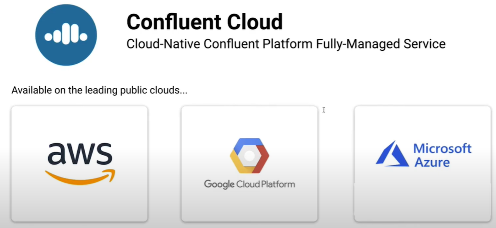

# MyConfluentKafka

My Confluent Kafka

## Fundamentals

Event streaming

Event driven

Contextual Event-Driven Apps

Confluent Control Center

Confluent CLI

RBAC

Role binding

Resource scoping

KSQL / ksqlDB

Confluent KSQL is the streaming SQL engine that enables real-time data processing against Apache Kafka.

Confluent Schema Registry

Confluent Connector for Kubernetes

Enterprise Kafka

Confluent Operator

SASL Plain

PLAIN, or SASL/PLAIN, is a simple username/password authentication mechanism that is typically used with TLS for encryption to implement secure authentication.

Kafka connect

Kafka stream

Confluent Hub

Confluent REST Proxy

## Use cases

